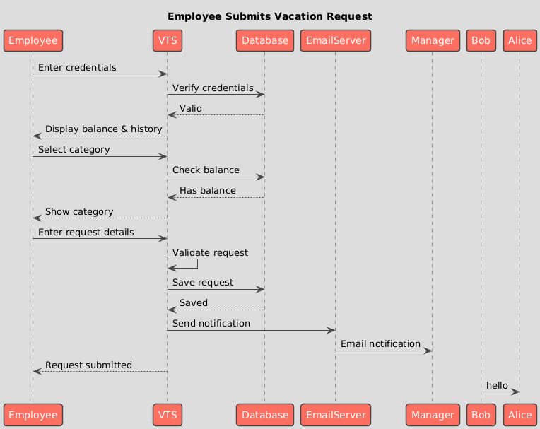
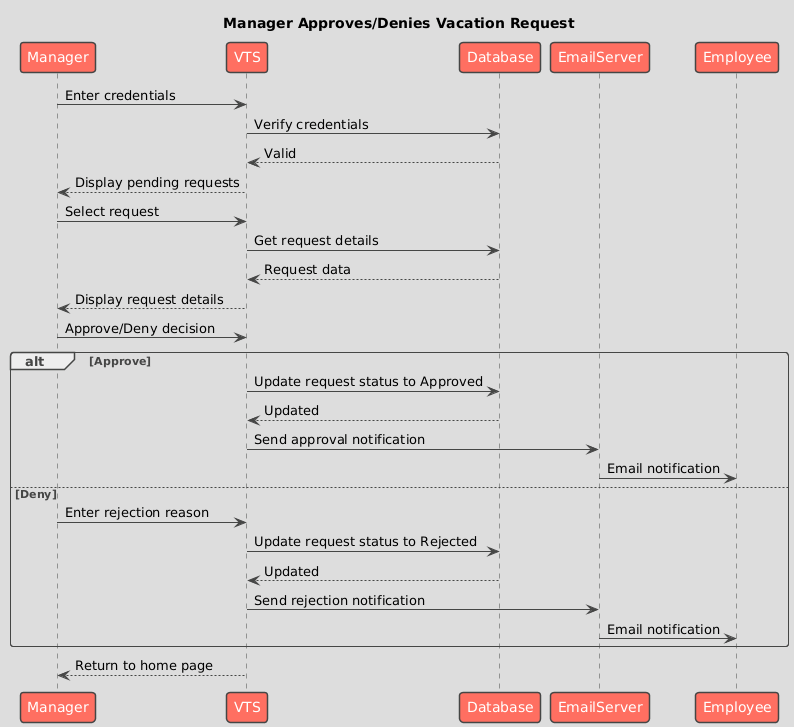
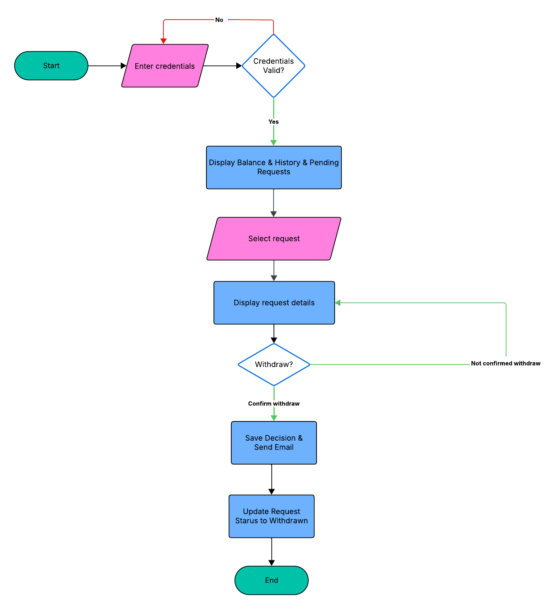
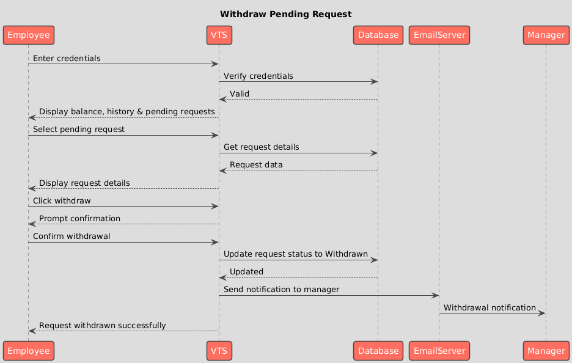

# Vacation Tracking System (VTS)

## 🎯 Vision

A Vacation Tracking System (VTS) will provide individual employees with the capability to manage their own vacation time, sick leave, and personal time off, without having to be an expert in company policy or the local facility's leave policies.

---

## 💼 Business Goals

The organization aims to:

- Give individual employees the capability and responsibility to manage this particular aspect of their employment agreements with the company
- Streamline the functions of the human resources (HR) department
- Minimize non-core business-related activities of management
- Give a sense of empowerment to the employees
- Reduce administrative overhead

---

## 📖 **Use case name: Manage Time**

## ⚙️ Functional Requirements

### Authentication & Access

1. The system must verify employees or managers using their credentials.

### Employee Functions

2. The system must display the employee balance and vacation history for the previous 6 months and up to 18 months in the future.
3. The system must only allow the user to select from categories of vacation time that have positive balance.
4. The system must provide a visual calendar to help users select and compare dates.
5. The system must provide a form where users can enter dates, hours per date, title, and description for their request.
6. The system must validate submitted information, and if incomplete or incorrect, redisplay the page with errors highlighted.
7. The system must provide the user with the option to change information or cancel the request.
8. The system must display request states (pending, rejected, or approved).
9. The system must send email notifications to employees when request status changes.

### Manager Functions

10. The system must display the manager's balance and vacation history with a section listing requests pending approval by subordinate employees.
11. The system must send email notifications to managers when approval is required.
12. The system must allow managers to approve or deny requests.
13. The system must provide a field for managers to enter an explanation when disapproving a request.
14. The system must return managers to the main VTS home page after processing requests.

### Additional Features

- System implements a flexible rules-based system for validating and verifying leave time requests
- Manager approval is optional (configurable)
- System provides access to requests for the previous calendar year and allows requests up to a year and a half in the future

---

## 🔧 Non-Functional Requirements

### Explicit Requirements (from Chapter 12):
- **Usability:** The system must be easy to use
- **Compatibility:** The system must work on Firefox

### Inferred Requirements (based on context):
- **Security:** The system must be accessible only within the company's network
- **Integration:** The system must integrate with the existing intranet portal
- **Performance:** Email notifications should be sent promptly after actions

*Note: Chapter 12 provides limited explicit non-functional requirements. Additional requirements would need to be elicited from stakeholders in a real project.*

---

## 🚧 Constraints

### Technical/Architectural:
- The system must prevent the client browser from being in direct contact with the database or business application components.
- The system must integrate with the company's existing intranet portal.

### Infrastructure:
- The system must operate only within the company's network.
- The system must use the company's existing email server.

### Business/Policy:
- The system must comply with company leave policies and rules.
- Manager approval requirements must be configurable per company policy.

*Note: Some constraints are inferred from the system context, as Chapter 12 does not explicitly list all constraints.*

---

## 🌍 Problem Domain

### Problem Statement

Employees and managers currently rely on manual processes and HR intervention to request, track, and approve vacation time, resulting in administrative overhead, delays, and lack of employee autonomy.

---

### Scope - IN (VTS Responsibilities):

* VTS is responsible for providing users with a website to manage vacations
* VTS is responsible for verifying users with credentials
* VTS is responsible for providing users with their vacation balance and history
* VTS is responsible for allowing users to create vacation requests
* VTS is responsible for allowing managers to review and take actions on vacation requests
* VTS is responsible for sending email notifications to managers when there are requests to review
* VTS is responsible for sending notifications to employees when actions are taken on their requests
* VTS is responsible for calculating 4 hours as 1/2 day vacation automatically
* VTS is responsible for displaying available vacation categories to users
* VTS is responsible for routing approval requests to appropriate managers
* VTS is responsible for validating vacation requests against available balances and business rules

---

# Why should I provide these? aren't they clear?
### Scope - OUT (NOT VTS Responsibilities):

* VTS is NOT responsible for defining company vacation policies or creating vacation categories (uses existing policies)
* VTS is NOT responsible for creating or managing the organizational structure (uses existing employee-manager relationships)
* VTS is NOT responsible for sending notifications to HR department
* VTS is NOT responsible for validating if vacation days contain holidays
* VTS is NOT responsible for adding default hours for the day (users must enter manually)

---

## 👥 Actors

### Human Actors:
- **Employee:** Can request vacation time and review vacation history and balance
- **Manager:** Can approve/deny vacation requests from subordinates, and can also request vacation time for themselves

### System Actors:
- **Email Server:** Sends email notifications to managers and employees regarding vacation request status
- **Intranet Portal:** Provides access point for employees and managers to reach the VTS

---

## Request Vacation- Employee Main Flow

## Taking Actions on Vacations Requests- Manager Main Flow

---

---
## 📚 Reference

This project is based on:
- **Book:** Object-Oriented Analysis and Design with Applications (Third Edition)
- **Authors:** Grady Booch, Robert A. Maksimchuk, Michael W. Engle, Bobbi J. Young, Ph.D., Jim Conallen, Kelli A. Houston
- **Chapter:** 12 - Web Application: Vacation Tracking System

---

## 📝 Learning Objectives

- Understanding requirements gathering and analysis
- Applying UML diagrams to real-world scenarios
- Practicing Object-Oriented Analysis and Design principles
- Creating comprehensive system documentation

---

# Withdraw Pending Request

## Use Case Description

**Goal:** The employee wants to withdraw an outstanding request for vacation time that is currently pending approval.

**Actor:** Employee

**Preconditions:** 
- Employee is authenticated
- Employee has made a vacation time request
- Request status is "Pending" (not yet approved or denied by manager)

## Flowchart

## Sequence Diagram

